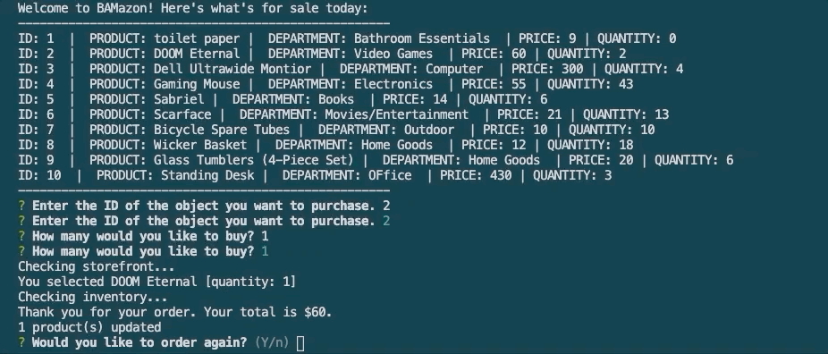

# BAMazon

## SUMMARY
This is a node-based storefront application built using Node.js and MySQL.


***


## How does it work?

### DEV SIDE

**Node.js** and **MySQL** are used in tandem to maintain and query a database of store products from BAMazon.

The database is built with MySQL workbench and populated with ten products. The bamazonCustomer.js file can query and update the database as the user interacts with the application.


### USER SIDE

Through the terminal, the user can:

* See all products for sale, including:
    * ID
    * Product Name
    * Department
    * Unit Price
    * Stock Quantity;

* Purchase a product; and

* Terminate the connection to the application or order again.


***


## Functionality Demo

### Initialize

Initiate the BAMazon application in the terminal with one of these commands: 

```javascript
node bamazonCustomer.js
```


or 

```javascript
nodemon bamazonCustomer.js
```


### Show the user the available products & ask which product the user would like to buy

When the application is initiated by the user (terminal prompt "node bamazonCustomer.js" or "nodemon bamazonCustomer.js"), a welcome message and the store's available products will populate in the terminal.

In this example, we'll purchase a copy of DOOM Eternal:


You can see that the console confirms the entry of each field, then immediately prints a message after this.


### Verify product

The message printed after the user enters the product ID and desired quantity is contingent upon certain verifications. There are three things the program will verify, which we'll look at.

**FIRST: Verify that the user has entered an appropriate ID that corresponds to a product.**

In our DOOM Eternal example, the program checks the storefront ("Checking storefront...") for the product. It then returns the message "You selected DOOM Eternal [quantity: 1]", acknowledging that the user has entered an ID that corresponds to a product.



**SECOND: Verify that the product is in stock.**

IN STOCK:
Let's use the DOOM Eternal example above again for a positive confirmation. You can see that the console then prints ("Checking inventory..."). Because there is enough inventory to fulfill this order, the console then prints a thank you message with the user's order total.

NOT IN STOCK:


**THIRD: Verify that the product is available in the quantity the user needs.**

You might be wondering how this is different from checking if the product is in stock. Well, in the DOOM Eternal example, it wasn't an issue--the user ordered one copy of the game, which was available.

Here's what happens when the product is available, but not in the quantity requested:


### Update the product listing if the purchase is successful.

Let's look at our DOOM Eternal example again. If you look at the previous storefront GIFs, you'll see there were two copies in stock before the user ordered. When the user ordered, the console printed several messages, one of which included "1 product(s) updated", meaning that the stock quantity for DOOM Eternal was updated to reflect this order. Now, there's only one in stock:

