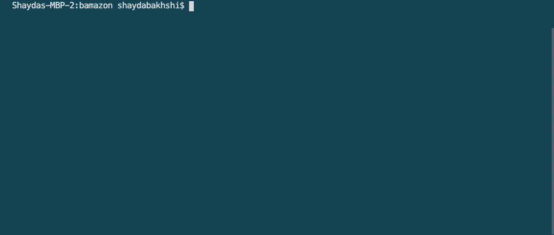

# BAMazon

## SUMMARY
This is a node-based storefront application built using Node.js and MySQL.

***

## How does it work?

### DEV SIDE

**Node.js** and **MySQL** are used in tandem to maintain and query a database of store products from BAMazon.

The database is built with MySQL workbench and populated with ten products. The bamazonCustomer.js file can query and update the database as the user interacts with the application.

### USER SIDE

Through the terminal, the user can:

* See all products for sale, including:
    * ID
    * Product Name
    * Department
    * Unit Price
    * Stock Quantity;

* Purchase a product; and

* Terminate the connection to the application or order again.

***

## Functionality Demo

### 0. Initialize

Initiate the BAMazon application in the terminal with the command "node bamazonCustomer.js" or "nodemon bamazonCustomer.js".

### 1. Show the user the available products & ask which product the user would like to buy

When the application is initiated by the user (terminal prompt "node bamazonCustomer.js" or "nodemon bamazonCustomer.js"), a welcome message and the store's available products will populate in the terminal.

In this example, we'll purchase a copy of DOOM Eternal:

### 2. 

### 3. Ask how many units of a given product the user would like to buy

### 4. Verify product

There are three things the program will verify:

1. Verify that the user has entered an appropriate ID that corresponds to a product.

2. Verify that the product is in stock.

3. Verify that the product is available in the quantity the user needs.

### 5. Ask which product the user would like to buy